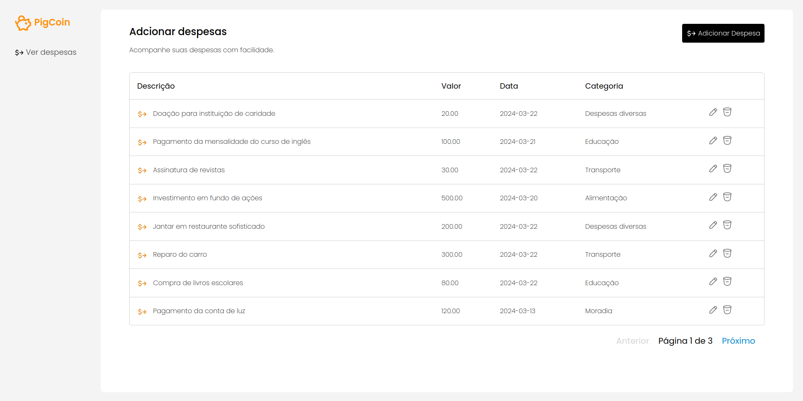

#  Registro de Despesas

Nesta atividade foi implementado uma aplicação com a arquitetura MVC, na qual a visão é um Single Page Application (SPA).

- Modelo (API): Registra despesas com categorias, valores e datas.
- View (Cliente): Permite ao usuário adicionar, visualizar, editar e excluir despesas.
- Controller (API e Cliente): lida com as operações relacionadas ao registro de despesas.

